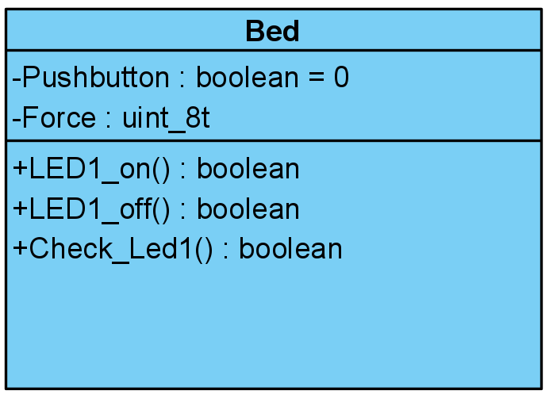
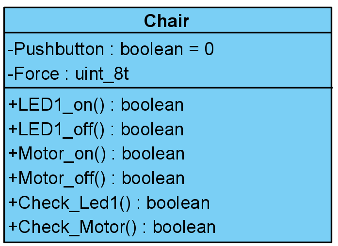
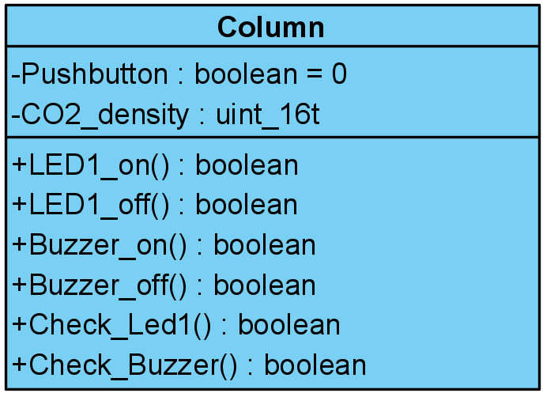
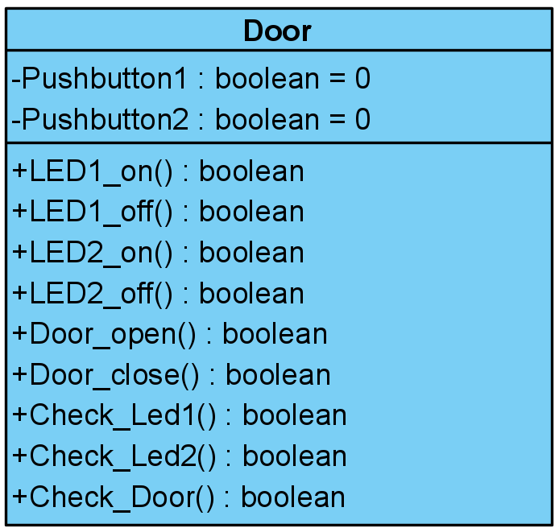
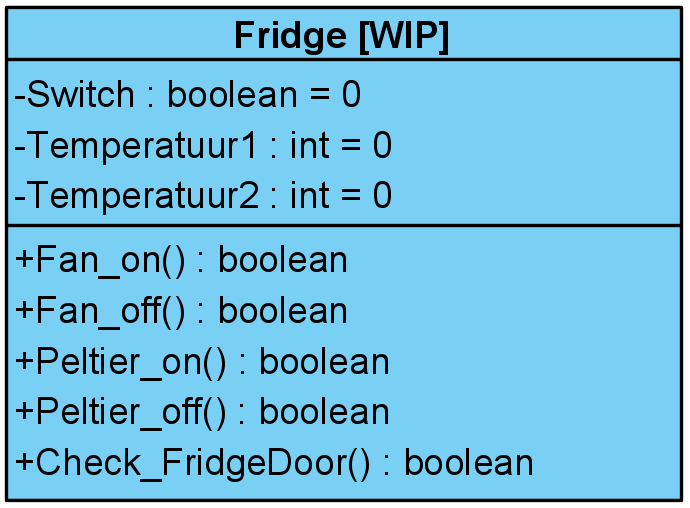
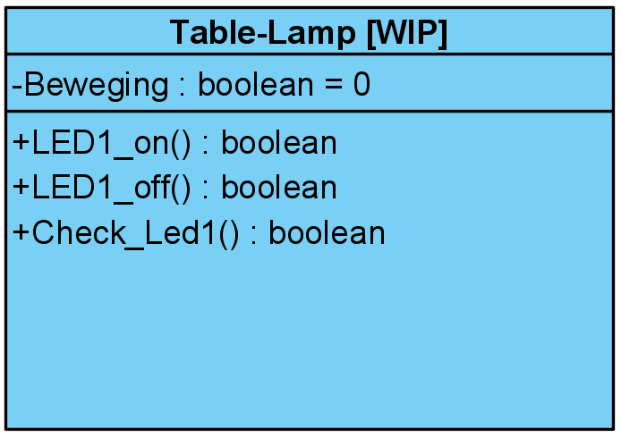
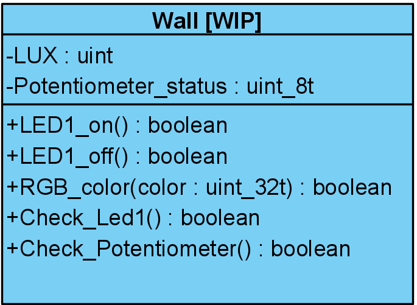

### Github Project System Development ###

# Raspberry Code

# WEMOS Code
Under the WEMOS Code subsection you can find the individual programs for the used setups. 

## Bed.ino

[./Setups/Bed.ino](./Setups/Bed.ino)
## Chair.ino

[./Setups/Chair.ino](./Setups/Chair.ino)
## Column.ino

[./Setups/Column.ino](./Setups/Column.ino)
## Door.ino

[./Setups/Door.ino](./Setups/Door.ino)
## Fridge.ino

[./Setups/Fridge.ino](./Setups/Fridge.ino)
## Table-Lamp.ino

[./Setups/Table-Lamp.ino](./Setups/Table-Lamp.ino)
## Wall.ino

[./Setups/Wall.ino](./Setups/Wall.ino)

Project System Development
	Domitica project van groep NSE-D3-gp11 te HHS, Delft
	

